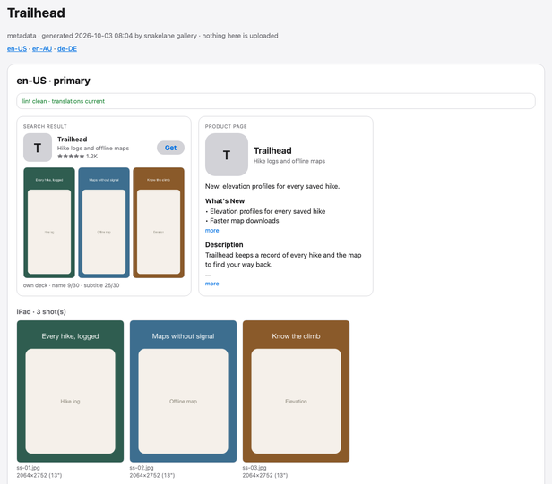

# snakelane

An opinionated App Store Connect CLI for indie Apple developers and coding agents. Keep
listings, screenshots, and purchase catalogues in your repo, review changes, and ship with a
focused Python workflow.
{ .lead }

{ .shot }

`snakelane store push` sends listing text, categories, screenshots, [App Previews](https://developer.apple.com/help/app-store-connect/reference/app-information/app-preview-specifications), in-app
purchases and subscriptions to the [App Store Connect API](https://developer.apple.com/documentation/appstoreconnectapi) from plain-text files.
`snakelane ship` runs test → archive → TestFlight → review. An [Archive post-action](https://developer.apple.com/documentation/xcode/customizing-the-build-schemes-for-a-project#Run-tasks-before-or-after-scheme-actions) keeps
build numbers right.

It covers the parts of fastlane a small app uses, without Ruby, lanes or a `Fastfile`. It is
written in Python, so a failure in CI is a readable traceback in a file you can open. It comes
with an agent skill, so a coding agent can run it, and fix it when it's wrong.

Once per machine, install an App Store Connect API key with `snakelane auth setup`. Then:

```bash
snakelane lint                     # what App Review would reject
snakelane store push --dry-run     # the diff against live, nothing written
snakelane store push               # diff against live, confirm, write, verify
snakelane shoot                    # the screenshot deck, from your UI test
snakelane gallery --live --open    # every deck beside what's live
snakelane store screenshots push
snakelane ship beta                # test → archive → TestFlight
```

## Framed for the App Store

`snakelane frame` captions your screenshots in three layouts (the caption over the screenshot,
above it, or above it shown as a card), in eight built-in looks or your own. Every one is on the
[Screenshot showcase](showcase.md); [Framing screenshots](reference/framing.md) explains the
settings.

<div class="frame-strip" markdown>
[](showcase.md#themes "felt: full-bleed, arch")
[](showcase.md#themes "parchment: full-bleed, sagging arch")
[](showcase.md#themes "indigo: stacked, band")
[](showcase.md#themes "campfire: stacked, cropped")
[](showcase.md#themes "azure: device card")
[](showcase.md#themes "dusk: device card, bleeding off")
</div>

!!! note "This repo shouldn't exist"
    Keeping your store listing, screenshots and purchases in your repo, and shipping them
    alongside the build, should be core functionality in Xcode. Apple has shown it can do
    this: [Game Center configuration](https://developer.apple.com/documentation/gamekit/initializing-and-configuring-game-center) lives in a `.gamekit` file in your project and syncs both
    ways with App Store Connect. Until the rest of the listing works like that, there's
    snakelane.

## What it does

--8<-- "README.md:features"

## Where to start

- New to snakelane: read [Getting started](getting-started.md), then
  [The config and the metadata tree](configuration.md).
- To try it before setting up an app, run it against the repo's
  [`examples/`](https://github.com/blite/snakelane/tree/main/examples): one app, and two apps
  sharing a repo. Neither needs an API key.
- To caption your screenshots: [Framing screenshots](reference/framing.md) explains the
  settings, and the [Screenshot showcase](showcase.md) shows every look.
