# Framing: layout, caption, theme

`snakelane frame` (and `shoot` with `frame: snakelane`) draws each caption from three
independent choices in `screenshots.framing`:

| Choice | Question it answers | Values |
|---|---|---|
| `layout` | Where does the capture go? | `full-bleed`, `stacked` (default), `device` |
| `caption` | What shape is the caption, and where? | `band` (default), `arch`, `callout`, `headline`; `top` or `bottom` |
| `theme` | What does it look like? | A built-in name, or your own colours, font and ornaments |

Any layout takes any caption shape and any theme. A slot can override the layout, the caption
and `fit`, and turn its capture.

## Layouts and caption shapes

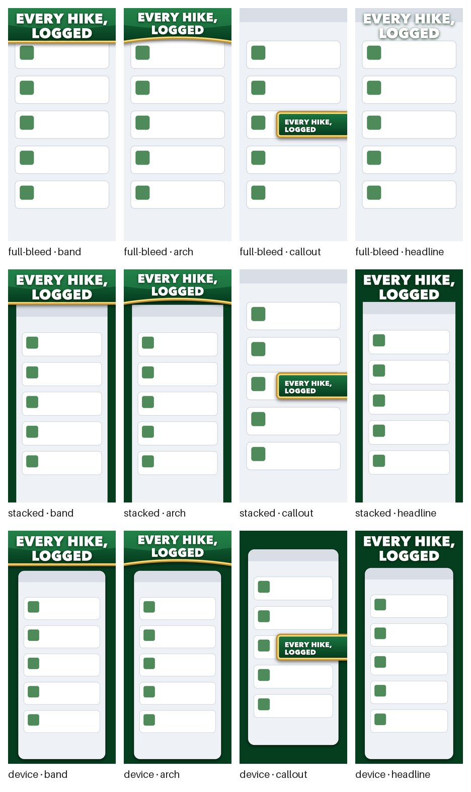

| Layout | The capture | When to use it |
|---|---|---|
| `full-bleed` | Fills the canvas; the caption lies over it. `fit: crop` (default) or `scale`; a slot's `bias` moves the crop (0 keeps the top, 1 the bottom) | The app leaves the caption's strip empty while it is screenshotted (see [making room](../commands/screenshots.md#making-room-for-the-band)), and key art |
| `stacked` | Caption and capture don't overlap; the capture takes the rest of the canvas: `fit: scale` shrinks it to fit (nothing lost), `fit: crop` fills the width and crops the far end | The app's screens use the whole display |
| `device` | A rounded card on the theme's background; `device.bleed` lets it run off the far edge | A marketing look, like storescreens' templates, without real bezels |

| Caption | What it is |
|---|---|
| `band` | A flat strip across the canvas |
| `arch` | A band whose inner edge bows toward the middle (`arch: 0.018`); a negative `arch` sags instead |
| `callout` | A rounded box hanging off the left or right edge, at `callout.centre` of the height |
| `headline` | The type alone, on whatever is behind it; the default for `device`. Over a light capture, give the theme a `text_shadow` |

## Caption text

Captions take a few Markdown-style marks:

| Write | Gets |
|---|---|
| `**word**` | The theme's bold face (`bold_face`) |
| `*word*` | The theme's italic face (`italic_face`). `indigo` and `campfire` have none, and say so |
| `==word==` | The theme's accent colour |
| `[word]{gold}` or `[word]{#E8932A}` | A colour named in the theme's `colors`, or any hex colour |
| `\n`, `<br>`, or a list | A line break. `["Every hike,", "logged"]` is two lines |

Marks combine (`**==logged==**`) and stay within a line. An unclosed mark stops the run, so a
stray asterisk never ships; write a literal one as `\*`. `case: upper` capitalises the words,
never the marks or colour names.

```yaml
captions:
  "1": ["**Every** *hike*,", "==logged== [offline]{moss}"]
theme: {base: parchment, colors: {moss: "#4F7A3A"}}
```

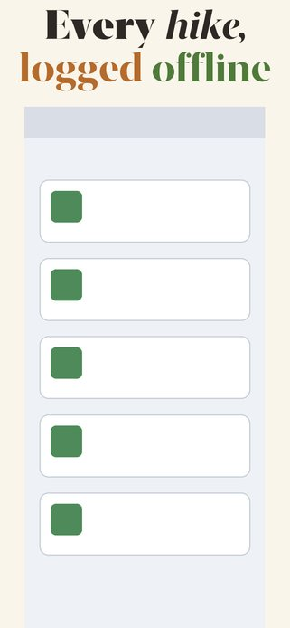{ width="200" }

### Captions per locale

One map of shot numbers captions every locale's deck. To translate them, key the map by ASC
locale instead, each value a map of shot numbers:

```yaml
captions:
  en-US: {"1": "All your cameras.\n==No cloud.==", "2": "Every feed, one grid"}
  de-DE: {"1": "Alle Kameras.\n==Keine Cloud.==", "2": "Jedes Bild, ein Raster"}
```

A locale without an entry gets the primary locale's captions (`primary_locale`, default the
first of `locales`); `frame` and `shoot --dry-run` print a line saying so. A locale with an
entry must caption every shot it has, as the one map must. The two forms don't mix: shot
numbers and locales in one map is an error. Marks are checked in every locale's captions on
every run, so a broken translation fails before it is drawn.

## Themes

The built-in themes are the looks the apps snakelane grew out of drew in their own UI tests,
taken over number for number. Each is shown in the layout and caption its app used; any theme
works with any of them. List them with `snakelane frame --list-themes`, and try one on your
own raw captures without touching the deck:

```bash
snakelane frame --theme dusk     # into .snakelane/<app>/themes/dusk/, not the deck
```

<div class="grid cards showcase" markdown>

-   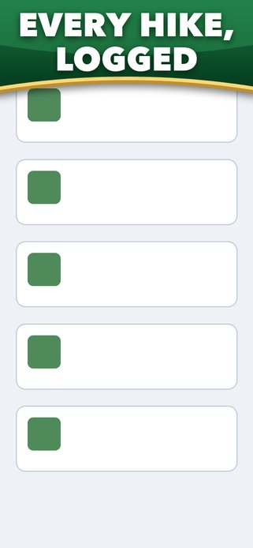{ width="160" }

    **`felt`**: Card-table green arch, gold lip, heavy Avenir capitals

    Shown as `full-bleed` · `arch` · depth 0.158

-   { width="160" }

    **`ruby`**: Felt's rail in card-room red

    Shown as `full-bleed` · `arch` · depth 0.158

-   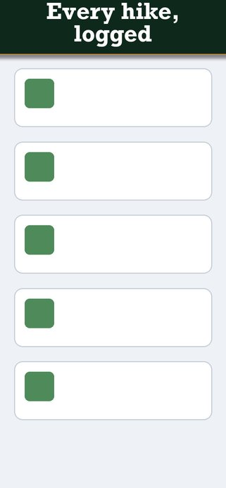{ width="160" }

    **`evergreen`**: Dark green strip, copper rule, cast shadow, Rockwell slab serif

    Shown as `full-bleed` · `band` · depth 0.11

-   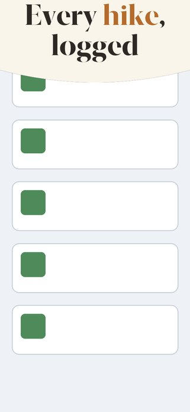{ width="160" }

    **`parchment`**: Warm parchment, New York serif ink, copper accent

    Shown as `full-bleed` · `arch` · arch −0.03 (sags), depth 0.17

-   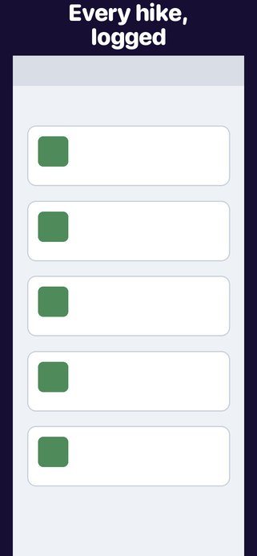{ width="160" }

    **`indigo`**: Night indigo band and letterbox, SF Rounded

    Shown as `stacked` · `band`

-   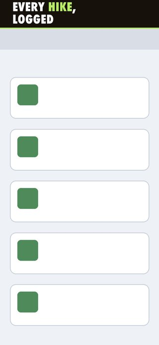{ width="160" }

    **`campfire`**: Near-black band, lime rule and accents, Futura condensed capitals

    Shown as `stacked` · `fit: crop` · `band`, left-aligned

-   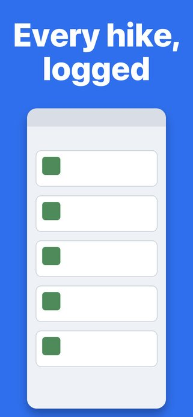{ width="160" }

    **`azure`**: Brand-blue canvas, SF Heavy

    Shown as `device` · `headline` · depth 0.24

-   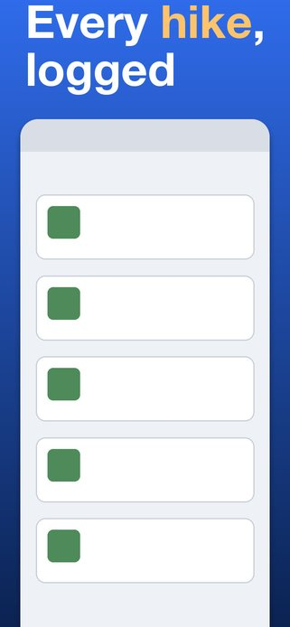{ width="160" }

    **`dusk`**: Blue dusk gradient, Helvetica with amber `==accent==` words

    Shown as `device` with `bleed` · `headline`, left-aligned

</div>

### Variations

A theme is overridden key by key, so a recolour is a few lines of config rather than a new
theme. These three are the other apps' looks, written as overrides:

<div class="grid cards showcase" markdown>

-   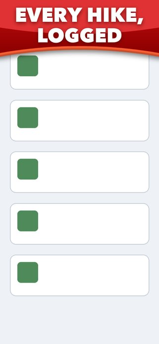{ width="160" }

    **coral**: `{base: ruby}` with a deep red fill, a coral rim and an opaque panel (Hearts)

    ```yaml
    theme: {base: ruby, fill: ["#C80C0E", "#8C0000"], panel: {color: "#E03234", opacity: 1},
     lip: {color: "#CC4C29", highlight: "#F65F34", height: 0.011}}
    ```

-   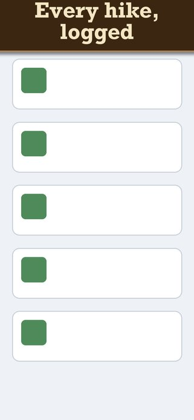{ width="160" }

    **walnut**: `{base: evergreen}` in walnut with cream type (Spades on the Mac)

    ```yaml
    theme: {base: evergreen, fill: "#3B2612", text: "#F5E6C4"}
    ```

-   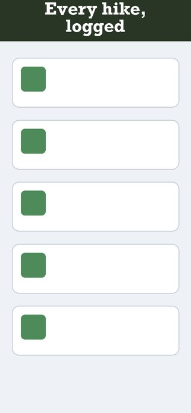{ width="160" }

    **moss**: `{base: evergreen}` as a plain band, no rule or shadow (Word Search)

    ```yaml
    theme: {base: evergreen, fill: "#293626", rule: null, shadow: null}
    ```

</div>

A theme is overridden key by key, so your brand colours go on top of a built-in look:

```yaml
theme: {base: felt, fill: ["#1A4F75", "#0A2440"], panel: {color: "#2A6C9C", opacity: 0.55}}
```

Fonts are the ones every Mac ships with. To use your own, point `font` at a file in your repo.

## Every key

```yaml
screenshots:
  frame: snakelane
  framing:
    captions: {"1": "Caption", "2": [line, line]}   # required; a list is the caption's lines
    # or per locale: {en-US: {"1": …}, de-DE: {"1": …}}; a locale without one gets the primary's
    targets: {iphone: [1284, 2778], ipad: [2064, 2752], mac: [2880, 1800]}  # default: each capture's size

    layout: stacked                     # full-bleed | stacked | device
    fit: scale                          # scale | crop (default crop for full-bleed)
    device: {width: 0.84, radius: 0.07, gap: 0.02, bleed: false}   # layout: device

    caption:
      shape: band                       # band | arch | callout | headline
      position: top                     # top | bottom, or per deck {iphone: top, mac: bottom}
      depth: 0.10                       # the caption's share of the canvas height
      size: null                        # instead of depth: a type size; the band grows to fit
      min_size: 52                      # with size: the smallest it shrinks to
      pad: 30                           # with size: space above and below the type
      margin: 110                       # left margin, and the side margins with size
      align: center                     # center | left
      arch: 0.018                       # shape arch: how far it bows (negative sags)
      callout: {edge: right, centre: 0.6, width: 0.66, height: 0.115, radius: 0.04,
                lip: null, shadow: null}  # shape callout; lip and shadow override the theme's

    theme: felt                         # a name, or a mapping:
    # theme:
    #   base: felt                      # start from a built-in theme
    #   fill: "#000000"                 # band, arch and callout; [top, bottom] for a gradient
    #   background: null                # behind a scaled or device capture; default fill
    #   text: "#FFFFFF"
    #   accent: null                    # `==words==` in a caption; default text
    #   colors: {gold: "#FFC46B"}       # names for `[words]{gold}`
    #   font: /System/Library/Fonts/HelveticaNeue.ttc
    #   font_face: Bold                 # a face in a .ttc, or a variable font's weight (SF: Heavy)
    #   bold_face: null                 # `**words**`; default font_face
    #   italic_face: null               # `*words*`; none: the theme has no italic
    #   italic_font: null               # the italic's file, when separate (SFNSItalic.ttf)
    #   bold_italic_face: null          # `***words***`; default italic_face
    #   case: as-written                # or upper
    #   rule: {color: "#B8EB66", height: 5}               # on the capture side of a band
    #   lip: {color: "#BF8F2E", highlight: "#FCD978", height: 0.012}
    #   panel: {color: "#298C4F", opacity: 0.55}          # a brighter sheet inside an arch
    #   shadow: {color: "#000000", opacity: 0.55, blur: 60, offset: [0, 16]}
    #   text_shadow: "#001F0A"          # or {color, opacity}
    #   outline: {color: "#FFFFFF", width: 6}             # round a device card

    slots:
      "2": {rotate: 90, caption: {shape: callout}}       # rotate: degrees, anticlockwise
      "4": {caption: {position: bottom}}
      "9": {bias: 0.62}                  # key art: full-bleed, crop toward the bottom, no reserve
```

Colours are `"#RRGGBB"`, `[r, g, b]`, or `{colorset: App/Assets.xcassets/…/brand.colorset}`,
read from the app's own asset catalog. Sizes (`lip`, `rule`, `shadow`, `outline`) are pixels
when whole, and a share of the canvas height when under 1. The built-in themes use shares, so
they keep their proportions on every device. Caption marks are under [Caption text](#caption-text).
