# Screenshot showcase

Every look `snakelane frame` draws, on the same stand-in app screen. Each card shows the
settings that produced it, under `screenshots.framing` in `snakelane.yml`.
[Framing: layout, caption, theme](reference/framing.md) explains each setting.

To see your own screenshots in any of these looks, without changing your deck:

```bash
snakelane frame --theme <name>
```

The images are generated by the test suite (`tests/test_showcase.py`), so they always show
what the current code draws. Regenerate them after changing the framer:

```bash
SNAKELANE_WRITE_SHOWCASE=1 uv run --group dev pytest tests/test_showcase.py
```

## Themes

Each built-in theme, in the layout and caption shape its app used.

<div class="grid cards showcase" markdown>

-   { width="200" loading=lazy }

    **felt**: Card-table green arch, gold lip, Avenir Next Heavy

    ```yaml
    layout: full-bleed
    caption: {shape: arch, depth: 0.158}
    theme: felt
    ```

-   { width="200" loading=lazy }

    **ruby**: Felt's rail in card-room red

    ```yaml
    layout: full-bleed
    caption: {shape: arch, depth: 0.158}
    theme: ruby
    ```

-   { width="200" loading=lazy }

    **evergreen**: Dark green strip, copper rule, Rockwell

    ```yaml
    layout: full-bleed
    caption: {depth: 0.11}
    theme: evergreen
    ```

-   { width="200" loading=lazy }

    **parchment**: Parchment, New York serif, a sagging arch

    ```yaml
    layout: full-bleed
    caption: {shape: arch, depth: 0.17, arch: -0.03}
    theme: parchment
    ```

-   { width="200" loading=lazy }

    **indigo**: Indigo band and letterbox, SF Rounded

    ```yaml
    layout: stacked
    theme: indigo
    ```

-   { width="200" loading=lazy }

    **campfire**: Lime rule and accents, Futura condensed

    ```yaml
    layout: stacked
    fit: crop
    caption: {depth: 0.08, align: left}
    theme: campfire
    ```

-   { width="200" loading=lazy }

    **azure**: Brand-blue device card, SF Heavy

    ```yaml
    layout: device
    caption: {depth: 0.24}
    theme: azure
    ```

-   { width="200" loading=lazy }

    **dusk**: Dusk gradient, a card that bleeds off the bottom

    ```yaml
    layout: device
    device: {bleed: true, width: 0.86}
    caption: {depth: 0.17, align: left}
    theme: dusk
    ```

</div>

## Variations

Recolours of a built-in theme, written as the overrides an app would use.

<div class="grid cards showcase" markdown>

-   { width="200" loading=lazy }

    **coral**: Ruby with Hearts' coral rim

    ```yaml
    theme: {base: ruby, fill: ["#C80C0E", "#8C0000"],
            lip: {color: "#CC4C29", highlight: "#F65F34"}}
    ```

-   { width="200" loading=lazy }

    **walnut**: Evergreen in walnut and cream

    ```yaml
    theme: {base: evergreen, fill: "#3B2612", text: "#F5E6C4"}
    ```

-   { width="200" loading=lazy }

    **moss**: Evergreen as a plain band

    ```yaml
    theme: {base: evergreen, fill: "#293626", rule: null, shadow: null}
    ```

</div>

## Every layout with every caption shape

All in the `felt` theme. Read across for caption shapes, down for layouts. Key art (a slot that isn't a screen) is a
`full-bleed` slot with a `bias`; see the last card below.


### `full-bleed`

<div class="grid cards showcase" markdown>

-   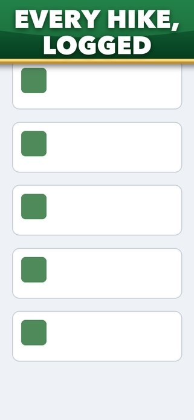{ width="200" loading=lazy }

    **full-bleed · band**: `band` caption

    ```yaml
    layout: full-bleed
    caption: {shape: band}
    ```

-   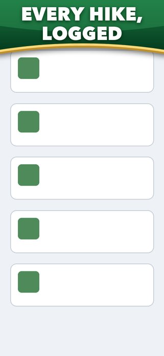{ width="200" loading=lazy }

    **full-bleed · arch**: `arch` caption

    ```yaml
    layout: full-bleed
    caption: {shape: arch}
    ```

-   { width="200" loading=lazy }

    **full-bleed · callout**: `callout` caption

    ```yaml
    layout: full-bleed
    caption: {shape: callout}
    ```

-   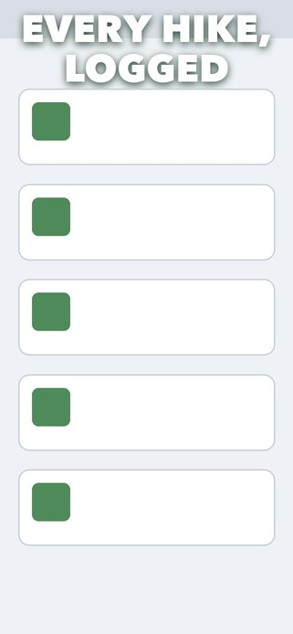{ width="200" loading=lazy }

    **full-bleed · headline**: `headline` caption

    ```yaml
    layout: full-bleed
    caption: {shape: headline}
    ```

</div>


### `stacked`

<div class="grid cards showcase" markdown>

-   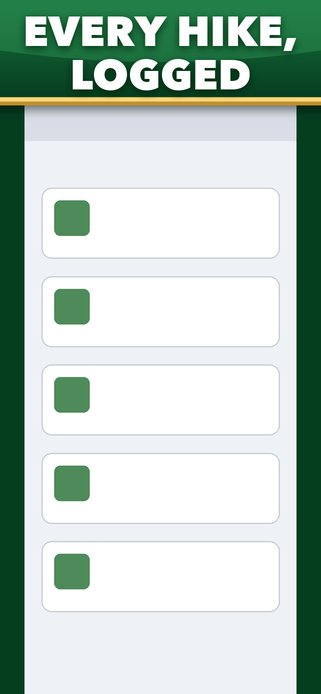{ width="200" loading=lazy }

    **stacked · band**: `band` caption

    ```yaml
    layout: stacked
    caption: {shape: band}
    ```

-   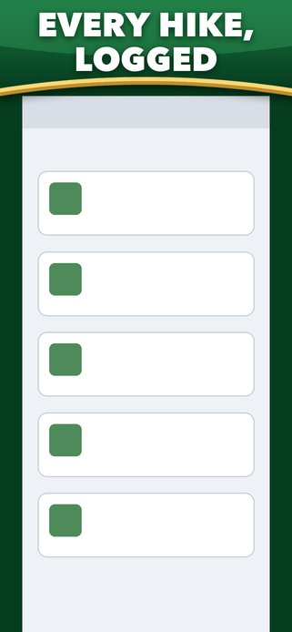{ width="200" loading=lazy }

    **stacked · arch**: `arch` caption

    ```yaml
    layout: stacked
    caption: {shape: arch}
    ```

-   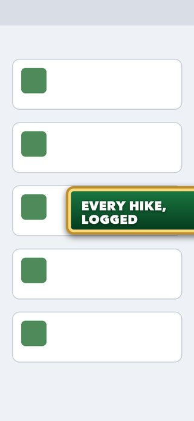{ width="200" loading=lazy }

    **stacked · callout**: `callout` caption

    ```yaml
    layout: stacked
    caption: {shape: callout}
    ```

-   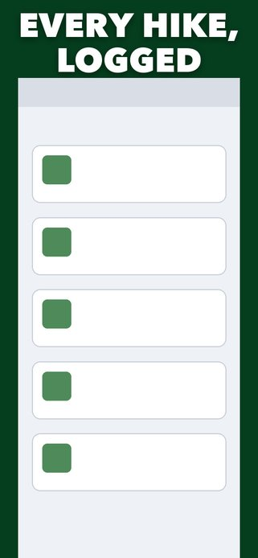{ width="200" loading=lazy }

    **stacked · headline**: `headline` caption

    ```yaml
    layout: stacked
    caption: {shape: headline}
    ```

</div>


### `device`

<div class="grid cards showcase" markdown>

-   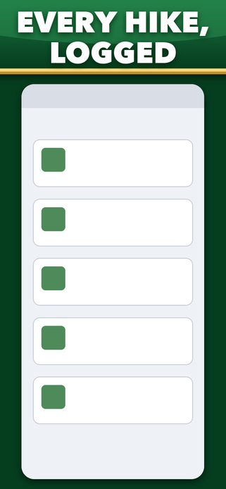{ width="200" loading=lazy }

    **device · band**: `band` caption

    ```yaml
    layout: device
    caption: {shape: band}
    ```

-   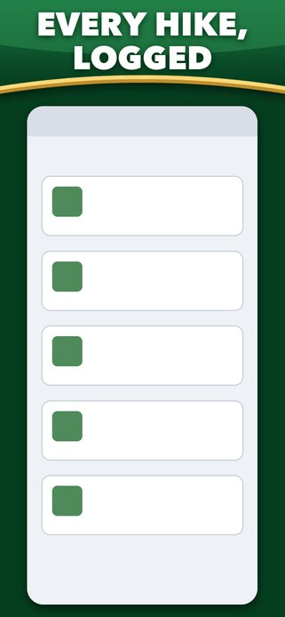{ width="200" loading=lazy }

    **device · arch**: `arch` caption

    ```yaml
    layout: device
    caption: {shape: arch}
    ```

-   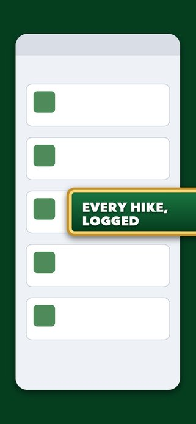{ width="200" loading=lazy }

    **device · callout**: `callout` caption

    ```yaml
    layout: device
    caption: {shape: callout}
    ```

-   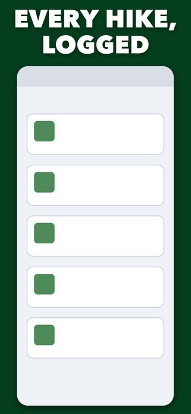{ width="200" loading=lazy }

    **device · headline**: `headline` caption

    ```yaml
    layout: device
    caption: {shape: headline}
    ```

</div>


## Bottom captions, turned captures, inline marks and key art

<div class="grid cards showcase" markdown>

-   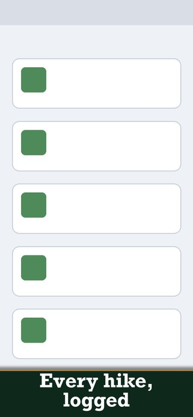{ width="200" loading=lazy }

    **bottom band**: A band at the bottom: rule and shadow face the capture

    ```yaml
    caption: {position: bottom}
    ```

-   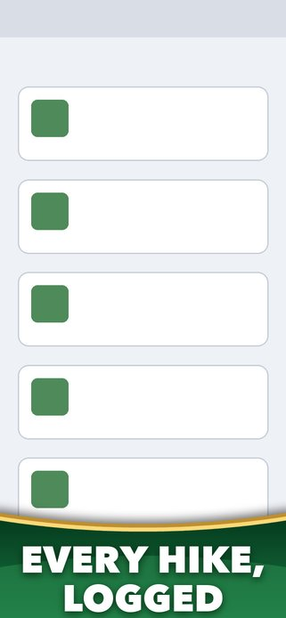{ width="200" loading=lazy }

    **bottom arch**: An arch at the bottom, mirrored

    ```yaml
    caption: {position: bottom, shape: arch}
    ```

-   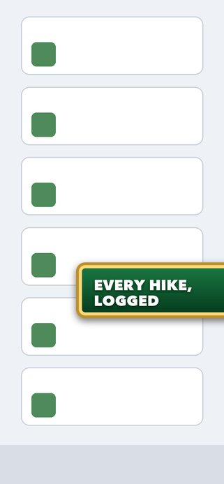{ width="200" loading=lazy }

    **landscape callout**: A landscape capture turned into a portrait deck, with a callout

    ```yaml
    slots:
      "1": {rotate: 90, caption: {shape: callout}}
    ```

-   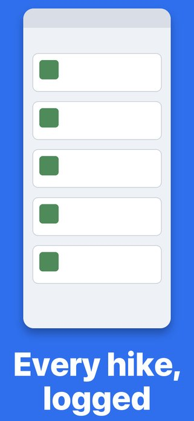{ width="200" loading=lazy }

    **device bottom**: A device card with its headline below

    ```yaml
    layout: device
    caption: {position: bottom}
    ```

-   { width="200" loading=lazy }

    **inline marks**: `**bold**`, `*italic*`, `==accent==` and `[words]{colour}`, one line per list item

    ```yaml
    captions:
      "1": ["**Every** *hike*,", "==logged== [offline]{moss}"]
    theme: {base: parchment, colors: {moss: "#4F7A3A"}}
    ```

-   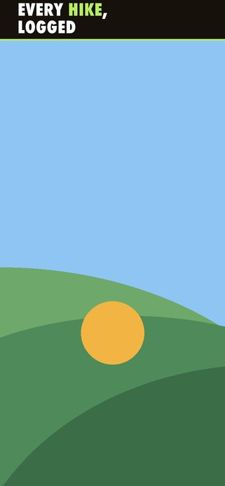{ width="200" loading=lazy }

    **key art**: A slot that isn't an app screen: full-bleed, the crop biased toward the bottom

    ```yaml
    slots:
      "9": {bias: 0.62}   # key art in raw/ as ss-09: crop toward the bottom
    ```

</div>
